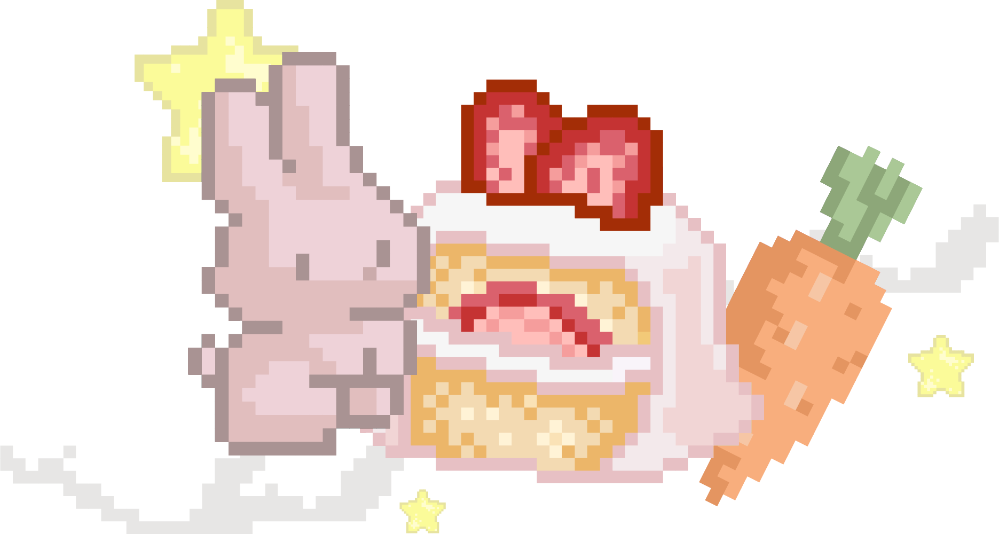
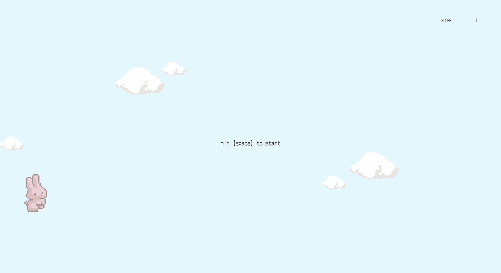
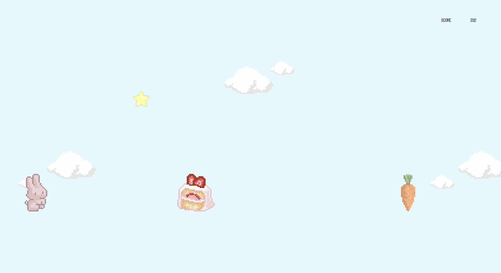
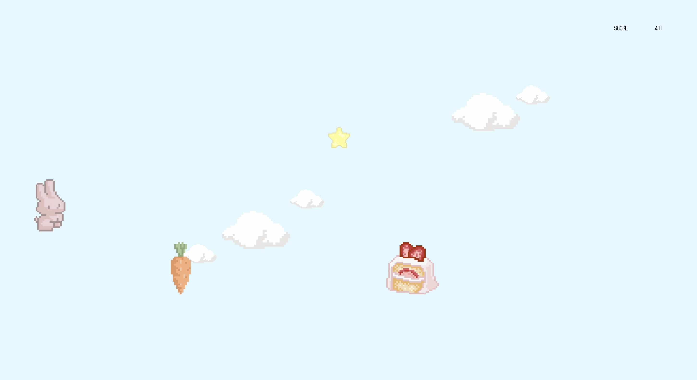
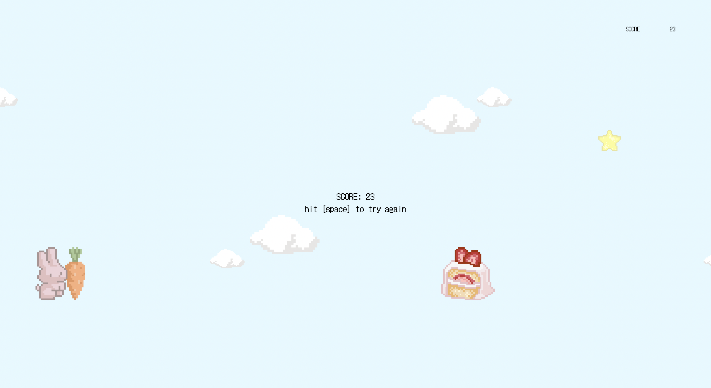

# not-floppy

This is the dino game that I'd rather play when my network is so bad. Updating the dino to a bunny with more appealing colors to appeal to the right demographic. It aims to give you something to do while idling or, even help you when you have a tough project to complete (like I did with this one).

## features
- cute graphics in the signature pixel art style
- keyboard controls
- score tracking
- bonus points (+100) for collecting stars

## Technologies Used
- HTML/CSS/JS

## Trying out not-floppy

Play the game [here] (https://not-floopy.vercel.app/).

# how to play?

- tap [space] to jump over the obstacles
- collect the stars for an extra +100 points
- avoid the cake and carrots

## Next patch?
- increase the speed of the game for increased difficulty levels
- sounds and animation effects (eg when a star is collected)
- players can choose skins to play with like a different colored bunny or a bunny with a scarf (my sister suggested it)

